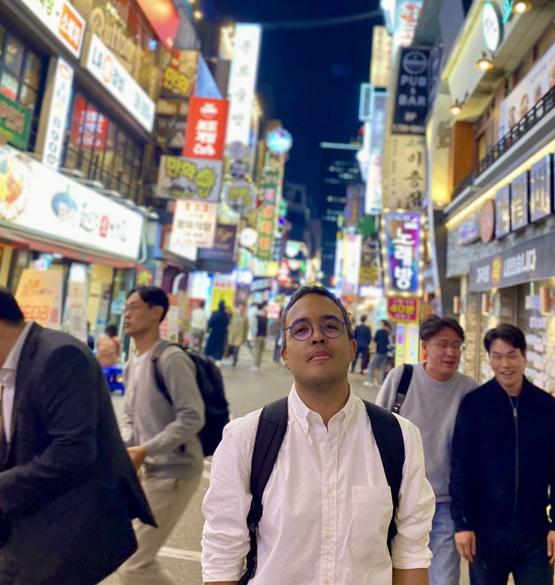
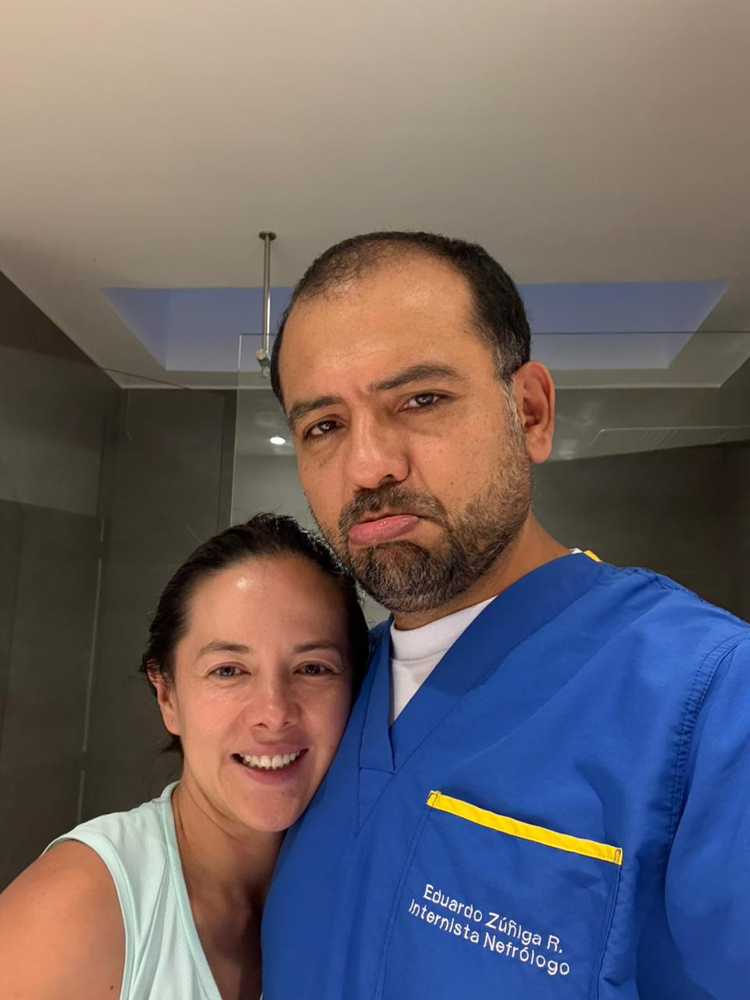

# 🩺 Curso de Ultrasonografía a la Cabecera del Paciente para Nefrólogos

**📍 Lugar:** Fundación Cardioinfantil, Bogotá, Colombia\
**📅 Fecha:** 23 y 30 de agosto 2025\
**⏱️ Duración:** 2 días\
**👨‍⚕️ Dirigido a:** Nefrólogos clínicos y en formación\
**🌐 Modalidad:** Presencial – con acceso a material digital complementario

------------------------------------------------------------------------

## 🎯 Objetivos de Aprendizaje

Al finalizar el curso, los participantes serán capaces de:

-   Identificar estructuras anatómicas clave en el examen renal, vesical y vascular con ultrasonido.
-   Integrar hallazgos ecográficos a la toma de decisiones clínicas en el contexto nefrológico.
-   Aplicar técnicas seguras de adquisición de imágenes en escenarios clínicos reales.
-   Distinguir imágenes normales y patológicas mediante interpretación comparativa.

------------------------------------------------------------------------

## 📅 Agenda del Curso

### Día 1: VExUS, Ecografía Pulmonar y Ecocardiografía básica

#### Objetivos del Día

-   Reconocer signos ecográficos de congestión venosa y pulmonar.
-   Clasificar grados de congestión usando el score VExUS.
-   Adquirir imágenes básicas: PLAX, PSAX, apical 4C.
-   Integrar hallazgos en la toma de decisiones clínicas.

#### Cronograma

| Hora | Actividad | Estrategia Pedagógica |
|------------------|--------------------------------|----------------------|
| 08:00 – 08:30 | Repaso grupal de esquemas de VExUS y B-lines desde memoria | Repetición espaciada + activación memoria |
| 08:30 – 09:00 | Quiz + discusión en parejas | Autoevaluación + retroalimentación |
| 09:00 – 11:00 | Práctica guiada en estaciones (VExUS + pulmón) | Visuospatial sketchpad + guía supervisada |
| 11:00 – 11:30 | Discusión de caso clínico interactivo | Elaboración creciente |
| 11:30 – 12:00 | Revisión de caso clínico propio | Transferencia contextual |
| 13:00 - 13:30 | Repaso grupal de los hallazgos en ecocardiograma | Repetición espaciada + activación memoria |
| 13:30 - 14:00 | Videos cortos: hallazgos normales vs. patológicos | Comparación dirigida |

### Día 2: Ecografia renal y del acceso vascular

#### Objetivos del Día

-   Adquirir imágenes básicas: Riñónes, vejiga y modo B fístula AV
-   Reconocer alteraciones al examen fisico de la fístula AV
-   Adquirir imagenes adecuadas en Doppler espectral de la fístula AV
-   Integrar hallazgos en la toma de decisiones clínicas.

#### Cronograma

| Hora | Actividad | Estrategia Pedagógica |
|------------------|---------------------------------|---------------------|
| 08:00 – 08:30 | Revisión imágenes normales en ultrasnografia renal y fístula AV | Reconocimiento visual |
| 08:30 – 09:00 | Videos cortos: hallazgos normales vs. patológicos | Comparación dirigida |
| 09:00 – 11:00 | Práctica guiada con supervisión directa (estaciones) | Carga cognitiva distribuida |
| 11:00 – 11:30 | Caso clínico complejo ( disfunción fistula AV) | Toma de decisiones clínicas |
| 11:30 – 12:00 | Quiz final + retroalimentación + cierre | Evaluación sumativa + reflexión |

------------------------------------------------------------------------

## 📚 Recursos Pre-curso

Te recomendamos revisar antes del curso:

-   [Guía rápida de principios de US renal (PDF)](recursos/guia_basica.pdf)
-   [Video: Cómo sostener el transductor correctamente (YouTube)](https://youtu.be/transductor)
-   [Artículo: POCUS en nefrología – revisión actual](recursos/articulo_revision.pdf)

------------------------------------------------------------------------

## 🧑‍🏫 Instructores

[{width="500"}](www.linkedin.com/in/juan-castellanos-de-la-hoz-814884163)

{width="500"}
